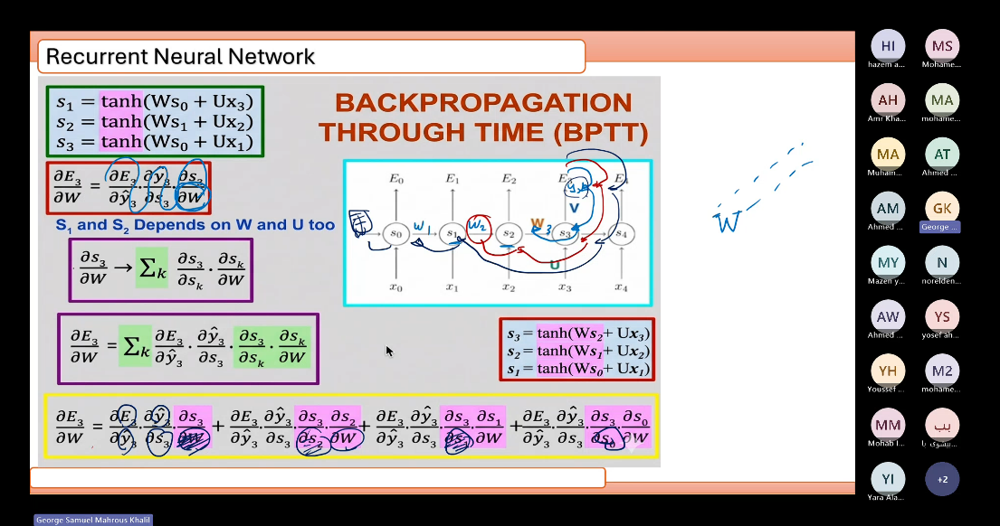
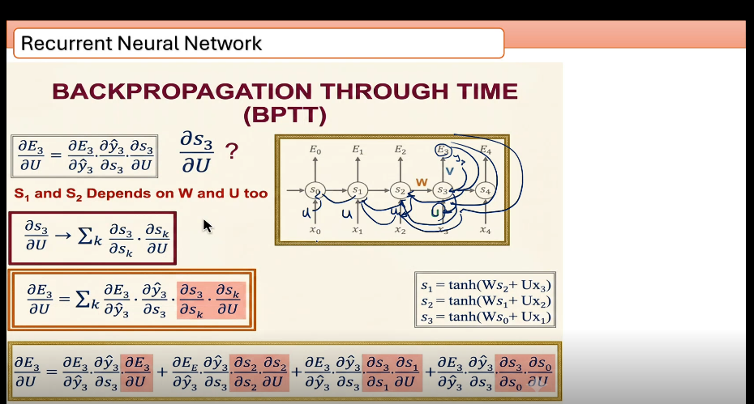
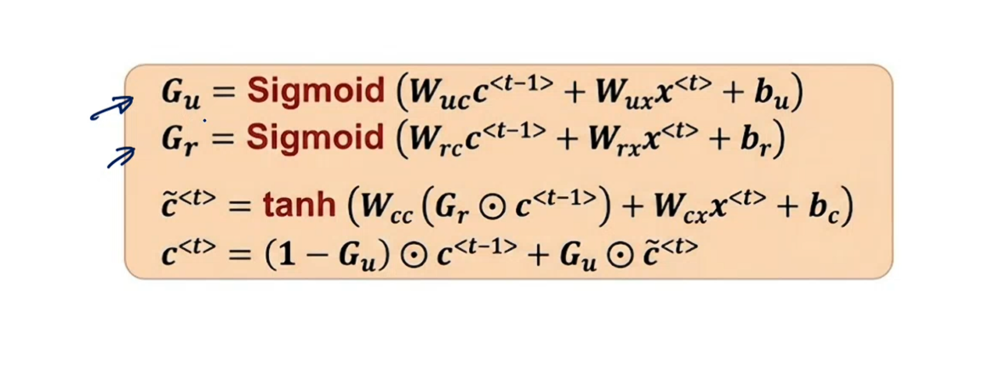

# NLP session 3 RNN 

Recurrent Neural Network

RNN applications -> fig 1

unfolded RNN -> fig 2

Xt - input vector at time time
Yt - output vectorat time time
St - hidden state vector at time

1 Xt represents a word of of a sentence

Xt is inserted to the neural hidden layer with activation function tanh 

the neural networks is fully connected through the current time

the neural networks are with the same dense through current time

by that the weights are shared through networks for the inputs to save the context of the words through the current time, changing weights in training will lead to losing core contextual information leads to generating no sense output

if the current will generate an output, so it will be y_hat
if not, it will saved as state of the next input word, and this is the state memory

St = f(st-1 , xt) = tanh(prevoius state + input) this if you want the current state

Ot = V.st -> this if you want y_hat

V , W , U

all weights but for different purposes

W -> is the shared weight through current time -> St

V -> weights for the softmax function to generate the output -> Yt

U -> weights multiplied by the input to enter it in the tanh function -> Xt

examples of sequance application of RNN - LSTM  fig 3

the inputs in one hot encoded and entered in word embedding method before inserting them to RNN

all the above represent the feed forward 

backpropagation through time BPTT

backprogation of weights
 

BP of U

BP of V

------------------

Vanishing Gradient problem --> lead us to the step of LSTM and GRU

-----------------

GRU logic, what do you want to forget from prev state and what do you want to forget to the current state

its working as adding to 2 gates in each state through the current time

gate 1 is reset gate, forgetting from prev state (sigmoid)

gate 2 is the update state, forgetting from the current state (sigmoid)

so the main function of the current RNN turned from tanh(prev.state + input * w)

it will be as following image

GRU image

-----------

LSTM 1997

